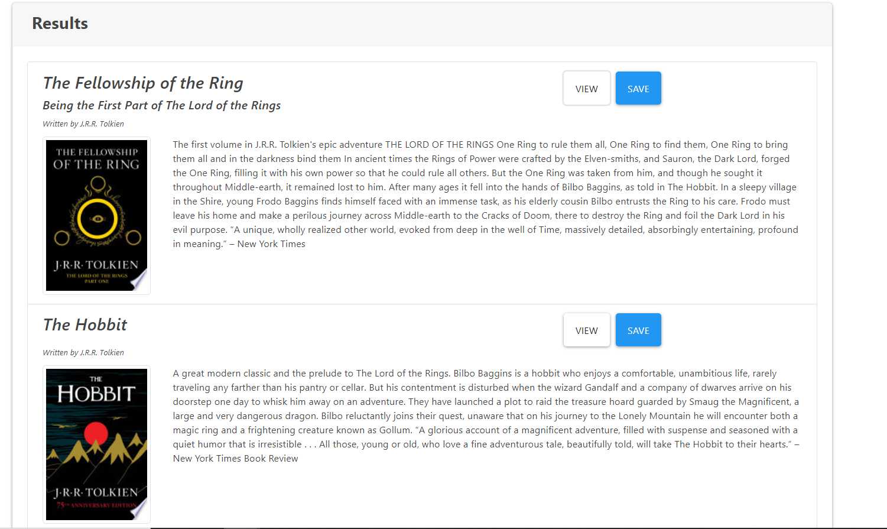

# google-books-search-react
A React App that lets you search through Google Books

    
* [Installation](#Installation)
    
* [Instructions](#Instructions)

* [Deployed Link](#Deployed-Link)
    
* [License](#License)
       
    ## Installation
    Make sure that you have Nodejs and mongoDB installed. Start the react app with the command: npm start 
    ## Instructions
    Search for books with the search box. You can then click the buttons to either save the book or view it on google books.
    ## Deployed Link
    https://react-google-books-holzer.herokuapp.com/

    ## License 
    This project is licensed under the MIT license
    - Email: timiholzer@gmail.com - GitHub Repo: https://github.com/timholzer/google-books-search-react